# LinkAble 화면설계서 (UX Design Document)

**프로젝트명**: LinkAble (링케이블)  
**버전**: v1.2  
**작성일**: 2025.01.XX  
**작성자**: 에이블 코디 팀

---

## 목차

1. [전체 사용자 플로우 (Flow Chart)](#1-전체-사용자-플로우-flow-chart)
2. [핵심 화면 와이어프레임](#2-핵심-화면-와이어프레임)
3. [각 화면의 기능 설명](#3-각-화면의-기능-설명)

---

## 1. 전체 사용자 플로우 (Flow Chart)

### 1.1 일반 사용자 플로우 (상세)

```mermaid
flowchart TD
    Start([사용자 접속]) --> Home[홈페이지 /]

    Home --> |비로그인| ChatGuest[채팅 시작 /chat<br/>게스트 모드]
    Home --> |로그인 필요| SignIn[로그인 /sign-in]

    SignIn --> |성공| CheckRole{역할 확인}
    SignIn --> |실패| Error1[에러 메시지<br/>재시도]
    Error1 --> SignIn

    CheckRole --> |역할 없음| Onboarding[역할 선택 /onboarding]
    CheckRole --> |일반 사용자| Chat[채팅 시작 /chat]
    CheckRole --> |관리자/전문가| AdminDash[관리자 대시보드]

    Onboarding --> |선택 완료| Chat

    Chat --> |텍스트 입력| Input1[메시지 전송]
    Chat --> |음성 입력| Input2[STT 변환]
    Chat --> |이미지 업로드| Input3[이미지 분석]

    Input1 --> AI[AI 상담 진행<br/>Gemini API]
    Input2 --> AI
    Input3 --> AI

    AI --> |스트리밍 응답| Response[링커 응답 표시]
    AI --> |ICF 분석 완료| Analysis[ICF 분석 결과<br/>b/d/e 코드 추출]

    Analysis --> |자동 추천 생성| Recommend[추천 페이지<br/>/recommendations/[id]]
    Analysis --> |채팅 내 미리보기| Preview[추천 카드 2-3개<br/>미리보기]

    Preview --> |더 보기 클릭| Recommend

    Recommend --> |상품 클릭| ClickLog[클릭 로그 기록]
    ClickLog --> External[외부 구매 링크<br/>쿠팡/네이버]

    Recommend --> |14일 후 알림| IPPANotif[K-IPPA 평가 알림]
    IPPANotif --> IPPA[K-IPPA 평가<br/>/dashboard/ippa/[id]]

    IPPA --> |점수 입력| Calculate[효과성 점수 계산<br/>pre-post*importance]
    Calculate --> |제출 완료| Points[포인트 적립]
    Points --> Dashboard[내 상담 /dashboard]

    Dashboard --> |상담 카드 클릭| ConsultDetail[상담 상세<br/>/consultation/[id]]
    ConsultDetail --> |리포트 보기| Report[상담 리포트<br/>/consultation/report/[id]]
    ConsultDetail --> |추천 보기| Recommend

    Dashboard --> |새 상담 시작| Chat
    Dashboard --> |K-IPPA 평가| IPPA

    style Start fill:#e1f5ff,stroke:#01579b,stroke-width:3px
    style Home fill:#fff4e6,stroke:#e65100,stroke-width:2px
    style Chat fill:#f3e5f5,stroke:#4a148c,stroke-width:2px
    style AI fill:#e8f5e9,stroke:#1b5e20,stroke-width:2px
    style Analysis fill:#e0f2f1,stroke:#004d40,stroke-width:2px
    style Recommend fill:#e8f5e9,stroke:#2e7d32,stroke-width:2px
    style Dashboard fill:#fff3e0,stroke:#e65100,stroke-width:2px
    style IPPA fill:#fce4ec,stroke:#880e4f,stroke-width:2px
    style AdminDash fill:#ffebee,stroke:#b71c1c,stroke-width:2px
    style External fill:#e3f2fd,stroke:#0d47a1,stroke-width:2px
```

### 1.2 관리자 플로우 (상세)

```mermaid
flowchart TD
    Start([관리자 접속]) --> Home[홈페이지 /]
    Home --> SignIn[로그인 /sign-in]

    SignIn --> |인증 성공| CheckRole{역할 확인}
    CheckRole --> |admin/expert| AdminDash[관리자 대시보드<br/>/admin/dashboard]
    CheckRole --> |일반 사용자| Denied[접근 거부<br/>사용자 대시보드로 리다이렉트]
    CheckRole --> |미인증| SignIn

    AdminDash --> |전체 통계 탭| Analytics[플랫폼 통계<br/>총 사용자/상담/추천/K-IPPA]
    AdminDash --> |사용자 관리 탭| UserList[사용자 목록<br/>필터링: 전체/K-IPPA/활성]

    Analytics --> |차트 시각화| Charts[통계 차트<br/>추이 그래프]

    UserList --> |사용자 클릭| UserDetail[사용자 상세 정보<br/>이름/이메일/역할/상담수/추천수<br/>K-IPPA 평가수/평균 점수/포인트]
    UserDetail --> |상담 이력 클릭| ConsultDetail[상담 상세<br/>/consultation/[id]]
    UserDetail --> |K-IPPA 데이터| IPPAData[효과성 점수 추이<br/>히스토리]

    ConsultDetail --> |리포트 보기| Report[상담 리포트]
    ConsultDetail --> |추천 보기| Recommend[추천 목록]

    style Start fill:#e1f5ff,stroke:#01579b,stroke-width:3px
    style AdminDash fill:#ffebee,stroke:#b71c1c,stroke-width:3px
    style Analytics fill:#e3f2fd,stroke:#0d47a1,stroke-width:2px
    style UserList fill:#f1f8e9,stroke:#33691e,stroke-width:2px
    style UserDetail fill:#fff3e0,stroke:#e65100,stroke-width:2px
    style Denied fill:#ffebee,stroke:#c62828,stroke-width:2px
```

### 1.3 인증 플로우 (상세)

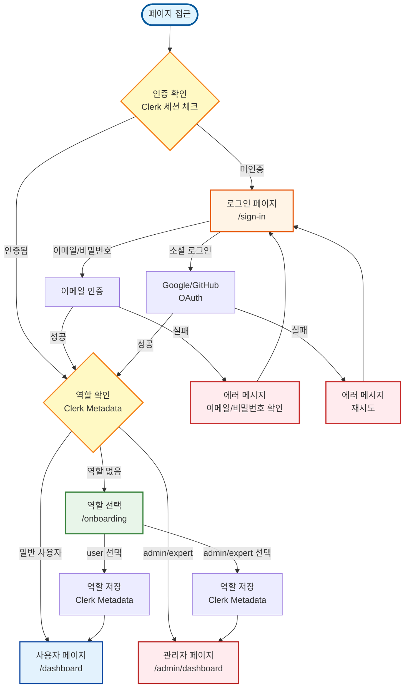

### 1.4 AI 상담 프로세스 시퀀스 다이어그램

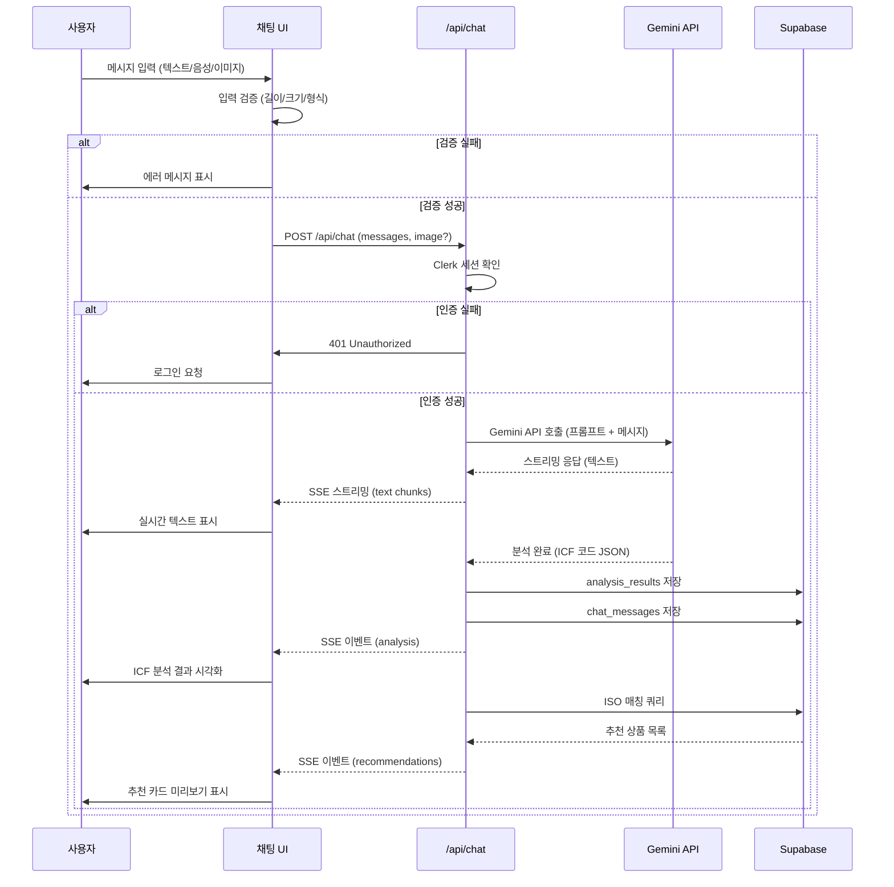

---

## 2. 핵심 화면 와이어프레임

> **참고**: 아래 와이어프레임은 텍스트 기반 표현입니다. 실제 구현 시 Shadcn UI 컴포넌트를 사용하여 시각적으로 구현됩니다.

### 2.1 홈페이지 (`/`)

```
┌─────────────────────────────────────────────────────────┐
│ [로고] LinkAble          [로그인] [회원가입] [대시보드]   │ ← Header
├─────────────────────────────────────────────────────────┤
│                                                           │
│              🎯 LinkAble                                  │
│         AI 기반 보조기기 매칭 서비스                      │
│                                                           │
│    [채팅 시작하기] 버튼                                   │
│                                                           │
├─────────────────────────────────────────────────────────┤
│  주요 기능                                                │
│  ┌──────────┐  ┌──────────┐  ┌──────────┐              │
│  │ AI 상담  │  │ ISO 매칭 │  │ K-IPPA   │              │
│  │          │  │          │  │ 평가     │              │
│  └──────────┘  └──────────┘  └──────────┘              │
├─────────────────────────────────────────────────────────┤
│  작동 방식                                                │
│  1. AI 상담으로 문제 파악                                 │
│  2. ICF 코드 추출                                         │
│  3. ISO 9999 매칭                                         │
│  4. 맞춤형 보조기기 추천                                  │
├─────────────────────────────────────────────────────────┤
│  [지금 시작하기] 버튼                                     │
├─────────────────────────────────────────────────────────┤
│  Footer: [이용약관] [개인정보처리방침] [문의]            │
└─────────────────────────────────────────────────────────┘
```

### 2.2 로그인 페이지 (`/sign-in`)

```
┌─────────────────────────────────────────────────────────┐
│ [로고] LinkAble                                          │
├─────────────────────────────────────────────────────────┤
│                                                           │
│              로그인                                       │
│                                                           │
│  ┌─────────────────────────────────────┐                │
│  │ 이메일                               │                │
│  │ [이메일 입력 필드]                    │                │
│  └─────────────────────────────────────┘                │
│                                                           │
│  ┌─────────────────────────────────────┐                │
│  │ 비밀번호                             │                │
│  │ [비밀번호 입력 필드] [👁️]            │                │
│  └─────────────────────────────────────┘                │
│                                                           │
│  [ ] 로그인 상태 유지                                     │
│                                                           │
│  ┌─────────────────────────────────────┐                │
│  │        [로그인] 버튼                │                │
│  └─────────────────────────────────────┘                │
│                                                           │
│  [비밀번호 찾기] [회원가입]                              │
│                                                           │
│  ─────────── 또는 ───────────                           │
│                                                           │
│  [Google 로그인] [GitHub 로그인]                        │
│                                                           │
└─────────────────────────────────────────────────────────┘
```

### 2.3 채팅 페이지 (`/chat`)

```
┌─────────────────────────────────────────────────────────┐
│ [로고] LinkAble          [대시보드] [로그아웃]            │
├─────────────────────────────────────────────────────────┤
│                                                           │
│  ┌─────────────────────────────────────┐                │
│  │ 👤 사용자                            │                │
│  │ 무릎이 아파서 계단 오르기가 힘들어요  │                │
│  └─────────────────────────────────────┘                │
│                                                           │
│  ┌─────────────────────────────────────┐                │
│  │ 🤖 링커                              │                │
│  │ 이해했습니다. 계단 오르기와 관련된   │                │
│  │ 불편함을 더 자세히 알려주세요.       │                │
│  └─────────────────────────────────────┘                │
│                                                           │
│  ┌─────────────────────────────────────┐                │
│  │ 📊 ICF 분석 결과                     │                │
│  │ [b280] [d450] [e115]                │                │
│  │ 분석 완료! 추천 상품을 확인하세요.   │                │
│  └─────────────────────────────────────┘                │
│                                                           │
│  ┌─────────────────────────────────────┐                │
│  │ 🛍️ 추천 상품 미리보기               │                │
│  │ ┌────┐ ┌────┐ ┌────┐                │                │
│  │ │상품│ │상품│ │상품│                │                │
│  │ │카드│ │카드│ │카드│                │                │
│  │ └────┘ └────┘ └────┘                │                │
│  │ [더 보기] 버튼                       │                │
│  └─────────────────────────────────────┘                │
│                                                           │
├─────────────────────────────────────────────────────────┤
│ [📎] [🎤] [텍스트 입력 필드] [전송]                     │
│                                                           │
└─────────────────────────────────────────────────────────┘
```

### 2.4 추천 페이지 (`/recommendations/[consultationId]`)

```
┌─────────────────────────────────────────────────────────┐
│ [로고] LinkAble          [대시보드] [로그아웃]            │
├─────────────────────────────────────────────────────────┤
│                                                           │
│  상담 요약                                                │
│  ┌─────────────────────────────────────┐                │
│  │ 주요 문제: 무릎 통증, 계단 오르기    │                │
│  │ ICF 코드: [b280] [d450] [e115]     │                │
│  │ [상담 상세 보기]                     │                │
│  └─────────────────────────────────────┘                │
│                                                           │
│  필터: [전체] [클릭됨] [미클릭]                          │
│  정렬: [추천순 ▼] [가격 낮은순] [가격 높은순] [이름순]   │
│                                                           │
│  ┌─────────────────────────────────────┐                │
│  │ [상품 이미지]                        │                │
│  │ 상품명: 무릎 보호대                  │                │
│  │ 가격: 29,000원                       │                │
│  │ 매칭 이유: 무릎 통증 완화에 도움     │                │
│  │ [구매하기] 버튼                     │                │
│  └─────────────────────────────────────┘                │
│                                                           │
│  ┌─────────────────────────────────────┐                │
│  │ [상품 이미지]                        │                │
│  │ 상품명: 계단 오르기 보조기           │                │
│  │ 가격: 89,000원                       │                │
│  │ 매칭 이유: 계단 오르기 활동 지원     │                │
│  │ [구매하기] 버튼                     │                │
│  └─────────────────────────────────────┘                │
│                                                           │
│  [더 보기] 버튼 (페이지네이션)                          │
│                                                           │
└─────────────────────────────────────────────────────────┘
```

### 2.5 내 상담 대시보드 (`/dashboard`)

```
┌─────────────────────────────────────────────────────────┐
│ [로고] LinkAble          [채팅 시작] [로그아웃]          │
├─────────────────────────────────────────────────────────┤
│                                                           │
│  내 상담                                                   │
│                                                           │
│  ┌─────────────────────────────────────┐                │
│  │ 상담 #1: 무릎 통증 관련              │                │
│  │ 상태: 완료 | 생성일: 2025-01-15      │                │
│  │ 추천: 3개 | 클릭: 1개                │                │
│  │ [상세 보기] [K-IPPA 평가]            │                │
│  └─────────────────────────────────────┘                │
│                                                           │
│  ┌─────────────────────────────────────┐                │
│  │ 상담 #2: 손목 통증 관련              │                │
│  │ 상태: 진행중 | 생성일: 2025-01-10    │                │
│  │ 추천: 2개 | 클릭: 0개                │                │
│  │ [이어서 하기] [상세 보기]            │                │
│  └─────────────────────────────────────┘                │
│                                                           │
│  ┌─────────────────────────────────────┐                │
│  │ K-IPPA 평가 대기                     │                │
│  │ 상담 #1의 추천 상품 평가가 가능합니다 │                │
│  │ [평가하기] 버튼                      │                │
│  └─────────────────────────────────────┘                │
│                                                           │
│  [더 보기] 버튼 (최근 10개 표시)                         │
│                                                           │
└─────────────────────────────────────────────────────────┘
```

### 2.6 상담 상세 페이지 (`/consultation/[id]`)

```
┌─────────────────────────────────────────────────────────┐
│ [로고] LinkAble          [대시보드] [로그아웃]            │
├─────────────────────────────────────────────────────────┤
│                                                           │
│  상담 정보                                                │
│  ┌─────────────────────────────────────┐                │
│  │ 제목: 무릎 통증 관련 상담            │                │
│  │ 상태: 완료                           │                │
│  │ 생성일: 2025-01-15 14:30            │                │
│  │ 업데이트: 2025-01-15 15:00          │                │
│  └─────────────────────────────────────┘                │
│                                                           │
│  상담 메시지 히스토리                                     │
│  ┌─────────────────────────────────────┐                │
│  │ 👤 사용자: 무릎이 아파서...          │                │
│  └─────────────────────────────────────┘                │
│  ┌─────────────────────────────────────┐                │
│  │ 🤖 링커: 이해했습니다...             │                │
│  └─────────────────────────────────────┘                │
│                                                           │
│  ICF 분석 결과                                            │
│  ┌─────────────────────────────────────┐                │
│  │ [b280] 감각 기능 및 통증            │                │
│  │ [d450] 걷기                         │                │
│  │ [e115] 제품 및 기술                 │                │
│  └─────────────────────────────────────┘                │
│                                                           │
│  생성된 추천 (3개)                                        │
│  ┌─────────────────────────────────────┐                │
│  │ [상품 카드 1] [상품 카드 2] [상품 카드 3]            │
│  └─────────────────────────────────────┘                │
│                                                           │
│  [상담 리포트 보기] [추천 전체 보기]                      │
│                                                           │
└─────────────────────────────────────────────────────────┘
```

### 2.7 K-IPPA 평가 페이지 (`/dashboard/ippa/[recommendationId]`)

```
┌─────────────────────────────────────────────────────────┐
│ [로고] LinkAble          [대시보드] [로그아웃]            │
├─────────────────────────────────────────────────────────┤
│                                                           │
│  K-IPPA 효과성 평가                                       │
│                                                           │
│  추천 상품: 무릎 보호대                                   │
│                                                           │
│  ┌─────────────────────────────────────┐                │
│  │ 사용 전 점수                         │                │
│  │ [1] [2] [3] [4] [5]                 │                │
│  │ (매우 불편함) ← → (매우 편함)        │                │
│  └─────────────────────────────────────┘                │
│                                                           │
│  ┌─────────────────────────────────────┐                │
│  │ 사용 후 점수                         │                │
│  │ [1] [2] [3] [4] [5]                 │                │
│  │ (매우 불편함) ← → (매우 편함)        │                │
│  └─────────────────────────────────────┘                │
│                                                           │
│  ┌─────────────────────────────────────┐                │
│  │ 중요도                               │                │
│  │ [1] [2] [3] [4] [5]                 │                │
│  │ (매우 낮음) ← → (매우 높음)          │                │
│  └─────────────────────────────────────┘                │
│                                                           │
│  ┌─────────────────────────────────────┐                │
│  │ 추가 피드백 (선택사항)               │                │
│  │ [텍스트 입력 필드]                   │                │
│  └─────────────────────────────────────┘                │
│                                                           │
│  [제출하기] 버튼                                         │
│                                                           │
│  ─────────── 이전 평가 ───────────                      │
│  ┌─────────────────────────────────────┐                │
│  │ 2025-01-01: 효과성 점수 8점 (양호)   │                │
│  │ 2024-12-15: 효과성 점수 6점 (보통)  │                │
│  └─────────────────────────────────────┘                │
│                                                           │
└─────────────────────────────────────────────────────────┘
```

### 2.8 관리자 대시보드 (`/admin/dashboard`)

```
┌─────────────────────────────────────────────────────────┐
│ [로고] LinkAble          [사용자 대시보드] [로그아웃]    │
├─────────────────────────────────────────────────────────┤
│                                                           │
│  전체 플랫폼 통계                                        │
│  ┌──────────┐ ┌──────────┐ ┌──────────┐ ┌──────────┐    │
│  │ 총 사용자│ │ 총 상담  │ │ 총 추천  │ │ K-IPPA   │    │
│  │   1,234  │ │   5,678  │ │  12,345  │ │  3,456   │    │
│  └──────────┘ └──────────┘ └──────────┘ └──────────┘    │
│                                                           │
│  필터: [전체 사용자] [K-IPPA 평가 완료] [활성 사용자]     │
│                                                           │
│  사용자별 종합 데이터                                     │
│  ┌──────────────────────────────────────────────────┐  │
│  │ 이름    │ 이메일        │ 상담│ 추천│ K-IPPA│ 점수│  │
│  ├──────────────────────────────────────────────────┤  │
│  │ 홍길동  │ hong@...      │ 5  │ 12 │  3   │ 7.5 │  │
│  │ 김철수  │ kim@...       │ 3  │ 8  │  2   │ 6.0 │  │
│  │ 이영희  │ lee@...       │ 7  │ 15 │  5   │ 8.2 │  │
│  └──────────────────────────────────────────────────┘  │
│                                                           │
│  [더 보기] 버튼 (페이지네이션)                          │
│                                                           │
└─────────────────────────────────────────────────────────┘
```

---

## 3. 각 화면의 기능 설명

### 3.1 화면별 기능 요약표

| 화면      | 주요 기능        | 입력값                            | 출력값            | 예외 처리                                          |
| --------- | ---------------- | --------------------------------- | ----------------- | -------------------------------------------------- |
| 홈페이지  | 서비스 소개, CTA | 없음                              | 정적 콘텐츠       | 네트워크 오류, 이미지 로드 실패                    |
| 로그인    | 인증             | email, password                   | 세션 토큰         | 이메일 형식 오류, 비밀번호 오류, 계정 없음         |
| 채팅      | AI 상담          | message, audio, image             | AI 응답, ICF 분석 | 메시지 길이 초과, 음성 인식 실패, 이미지 크기 초과 |
| 추천      | 상품 목록        | consultationId, filter, sort      | 상품 목록         | 상담 ID 없음, 추천 없음                            |
| 대시보드  | 상담 이력        | 없음                              | 상담 목록         | 로그인 필요, 데이터 로드 실패                      |
| 상담 상세 | 상담 정보        | id                                | 상담 데이터       | 상담 ID 없음, 권한 없음                            |
| K-IPPA    | 효과성 평가      | pre_score, post_score, importance | effect_score      | 점수 미입력, 범위 오류                             |
| 관리자    | 통계/사용자 관리 | 없음                              | 통계 데이터       | 권한 없음, 로그인 필요                             |

### 3.2 홈페이지 (`/`)

#### 기능 설명

- 서비스 소개 및 랜딩 페이지
- 주요 기능 섹션 (AI 상담, ISO 매칭, K-IPPA 평가)
- 작동 방식 안내
- CTA 버튼으로 채팅 시작 유도

#### 입력값

- 없음 (정적 페이지)

#### 예외 처리

- 네트워크 오류 시: 에러 메시지 표시
- 이미지 로드 실패: 플레이스홀더 이미지 표시

#### 기능 플로우

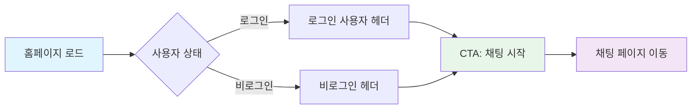

---

### 3.2 로그인 페이지 (`/sign-in`)

#### 기능 설명

- Clerk 인증을 통한 로그인
- 이메일/비밀번호 로그인
- 소셜 로그인 (Google, GitHub)
- 로그인 상태 유지 옵션

#### 입력값

- `email`: 이메일 주소 (필수, 이메일 형식 검증)
- `password`: 비밀번호 (필수, 최소 8자)
- `remember`: 로그인 상태 유지 (선택, boolean)

#### 예외 처리

- 이메일 형식 오류: "올바른 이메일 형식을 입력해주세요"
- 비밀번호 오류: "비밀번호가 일치하지 않습니다"
- 계정 없음: "등록되지 않은 이메일입니다"
- 네트워크 오류: "연결에 실패했습니다. 다시 시도해주세요"
- 인증 실패: "로그인에 실패했습니다. 이메일과 비밀번호를 확인해주세요"

---

### 3.3 채팅 페이지 (`/chat`)

#### 기능 설명

- AI 상담 인터페이스
- 텍스트/음성/이미지 입력 지원
- 실시간 스트리밍 응답
- ICF 분석 결과 시각화
- 추천 상품 미리보기

#### 입력값

- `message`: 텍스트 메시지 (필수, 최대 1000자)
- `audio`: 음성 입력 (선택, Web Speech API)
- `image`: 이미지 파일 (선택, 최대 5MB, image/\*)

#### 예외 처리

- 메시지 길이 초과: "메시지는 1000자 이하로 입력해주세요"
- 음성 인식 실패: "음성 인식을 실패했습니다. 다시 시도해주세요"
- 이미지 크기 초과: "이미지는 5MB 이하로 업로드해주세요"
- 이미지 형식 오류: "지원하는 이미지 형식(jpg, png, gif)만 업로드 가능합니다"
- AI 응답 오류: "상담 중 오류가 발생했습니다. 잠시 후 다시 시도해주세요"
- 네트워크 오류: "연결이 끊어졌습니다. 다시 시도해주세요"
- 브라우저 호환성: Safari/FF에서 음성 입력 비활성화 및 안내 메시지

#### 입력 처리 플로우

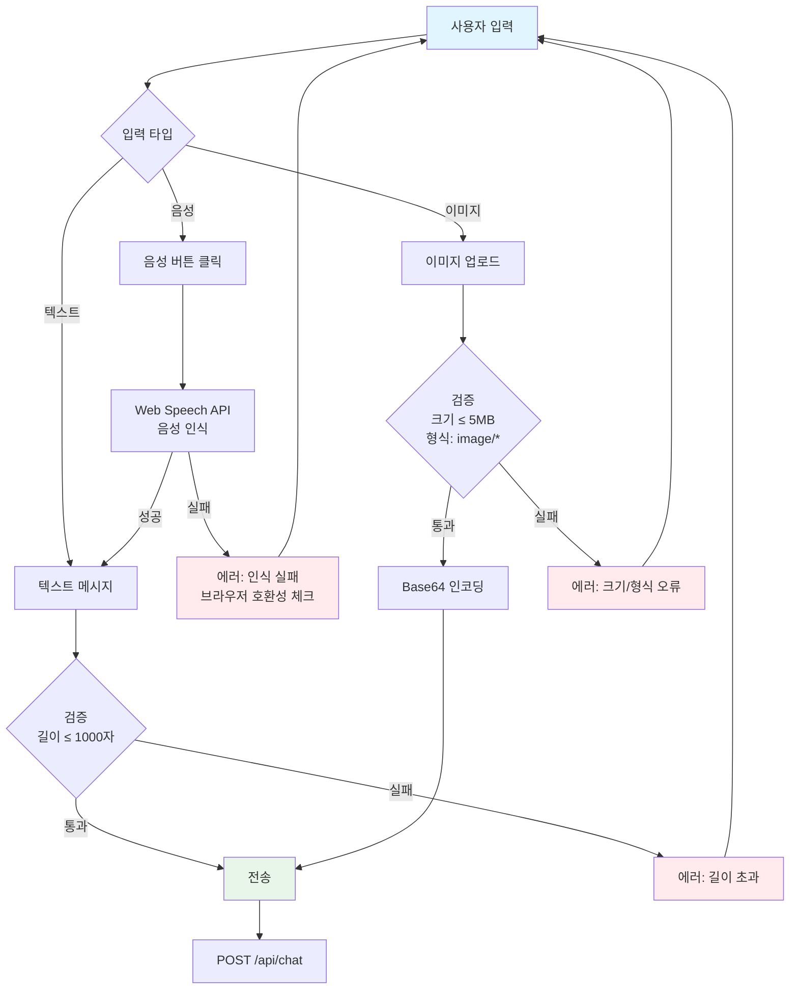

---

### 3.4 추천 페이지 (`/recommendations/[consultationId]`)

#### 기능 설명

- 상담 기반 추천 상품 목록 표시
- 필터링 (전체/클릭됨/미클릭)
- 정렬 (추천순/가격/이름)
- 상품 카드 클릭 시 외부 구매 링크 이동
- 클릭 로그 기록

#### 입력값

- `consultationId`: 상담 ID (URL 파라미터, 필수)
- `filter`: 필터 옵션 (선택, "all" | "clicked" | "not_clicked")
- `sort`: 정렬 옵션 (선택, "recommended" | "price_asc" | "price_desc" | "name")

#### 예외 처리

- 상담 ID 없음: "상담 정보를 찾을 수 없습니다"
- 추천 없음: "아직 추천된 상품이 없습니다"
- 상품 데이터 오류: "상품 정보를 불러오는 중 오류가 발생했습니다"
- 외부 링크 오류: "구매 페이지로 이동할 수 없습니다"

---

### 3.5 내 상담 대시보드 (`/dashboard`)

#### 기능 설명

- 개인 상담 이력 목록 (최근 10개)
- 상담 상태 및 추천 현황 표시
- K-IPPA 평가 대기 알림
- 상담 상세 페이지로 이동

#### 입력값

- 없음 (서버에서 자동 조회)

#### 예외 처리

- 로그인 필요: 로그인 페이지로 리다이렉트
- 상담 이력 없음: "아직 상담 이력이 없습니다. 첫 상담을 시작해보세요!"
- 데이터 로드 실패: "데이터를 불러오는 중 오류가 발생했습니다"

---

### 3.6 상담 상세 페이지 (`/consultation/[id]`)

#### 기능 설명

- 상담 메시지 전체 히스토리
- ICF 분석 결과 상세 확인
- 생성된 추천 목록
- 상담 리포트 및 추천 페이지로 이동

#### 입력값

- `id`: 상담 ID (URL 파라미터, 필수)

#### 예외 처리

- 상담 ID 없음: "상담 정보를 찾을 수 없습니다"
- 권한 없음: "이 상담에 접근할 권한이 없습니다"
- 데이터 로드 실패: "상담 정보를 불러오는 중 오류가 발생했습니다"

---

### 3.7 K-IPPA 평가 페이지 (`/dashboard/ippa/[recommendationId]`)

#### 기능 설명

- 추천 상품에 대한 효과성 평가
- 사용 전/후 점수 입력 (1-5점)
- 중요도 입력 (1-5점)
- 추가 피드백 입력 (선택)
- 이전 평가 히스토리 확인

#### 입력값

- `recommendationId`: 추천 ID (URL 파라미터, 필수)
- `pre_score`: 사용 전 점수 (필수, 1-5)
- `post_score`: 사용 후 점수 (필수, 1-5)
- `importance`: 중요도 (필수, 1-5)
- `feedback`: 추가 피드백 (선택, 최대 500자)

#### 예외 처리

- 추천 ID 없음: "추천 정보를 찾을 수 없습니다"
- 점수 미입력: "모든 점수를 입력해주세요"
- 점수 범위 오류: "점수는 1-5 사이의 값이어야 합니다"
- 제출 실패: "평가 제출에 실패했습니다. 다시 시도해주세요"
- 중복 제출 방지: "이미 평가를 제출하셨습니다"

#### K-IPPA 평가 프로세스

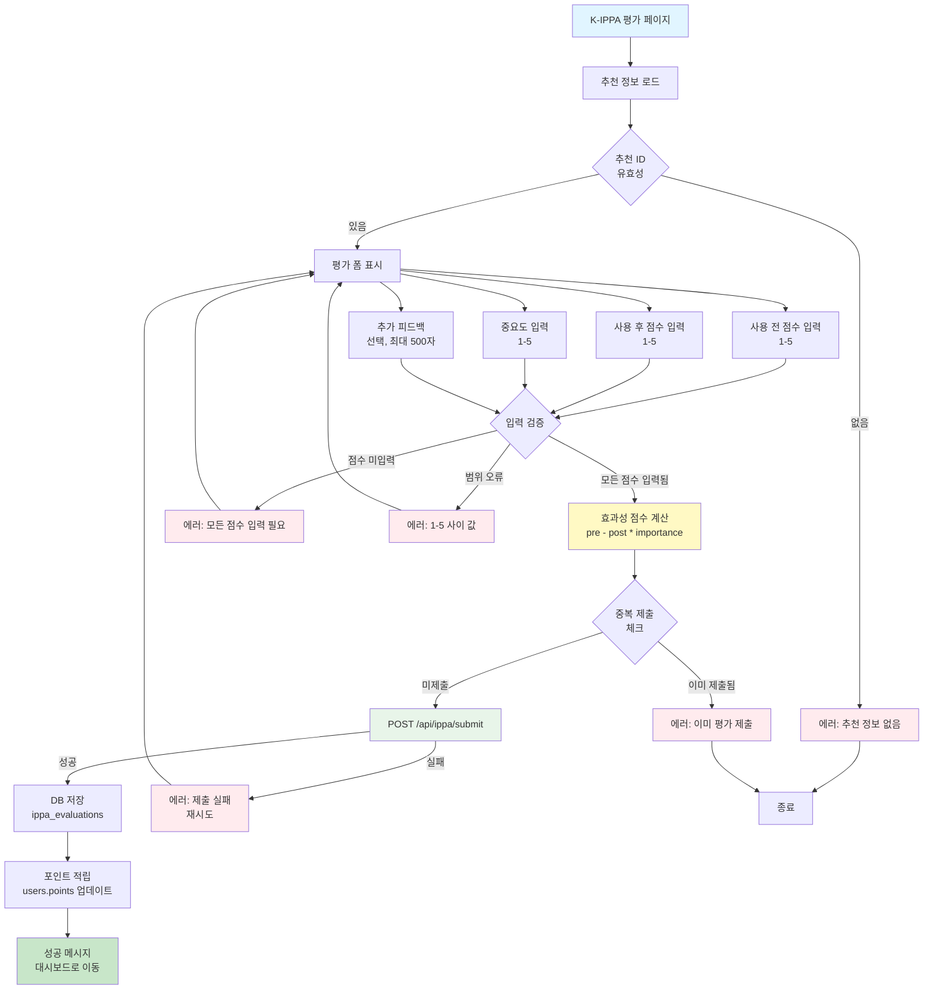

---

### 3.8 관리자 대시보드 (`/admin/dashboard`)

#### 기능 설명

- 전체 플랫폼 통계 확인
- 사용자별 종합 데이터 테이블
- 필터링 (전체/K-IPPA 완료/활성 사용자)
- 사용자 상세 정보 확인

#### 입력값

- 없음 (서버에서 자동 조회)
- 필터 옵션 (선택, 클라이언트 사이드)

#### 예외 처리

- 권한 없음: "관리자 권한이 필요합니다" 메시지 및 사용자 대시보드로 리다이렉트
- 로그인 필요: 로그인 페이지로 리다이렉트
- 데이터 로드 실패: "데이터를 불러오는 중 오류가 발생했습니다"

---

### 3.9 역할 선택 페이지 (`/onboarding`)

#### 기능 설명

- 첫 로그인 시 역할 선택
- 사용자/관리자/전문가 중 선택
- 선택한 역할을 Clerk 메타데이터에 저장

#### 입력값

- `role`: 역할 (필수, "user" | "admin" | "expert")

#### 예외 처리

- 역할 미선택: "역할을 선택해주세요"
- 저장 실패: "역할 저장에 실패했습니다. 다시 시도해주세요"

---

### 3.10 상담 리포트 페이지 (`/consultation/report/[id]`)

#### 기능 설명

- 상담 요약 및 ICF 분석 결과 전체 표시
- 환경 요소 분석 결과 시각화
- 생성된 추천 목록 링크
- PDF 다운로드 기능 (선택적)

#### 입력값

- `id`: 상담 ID (URL 파라미터, 필수)

#### 예외 처리

- 상담 ID 없음: "상담 정보를 찾을 수 없습니다"
- 권한 없음: "이 리포트에 접근할 권한이 없습니다"
- PDF 생성 실패: "PDF 다운로드에 실패했습니다"

---

## 3.5 예외 처리 플로우 시각화

### 3.5.1 통합 예외 처리 플로우

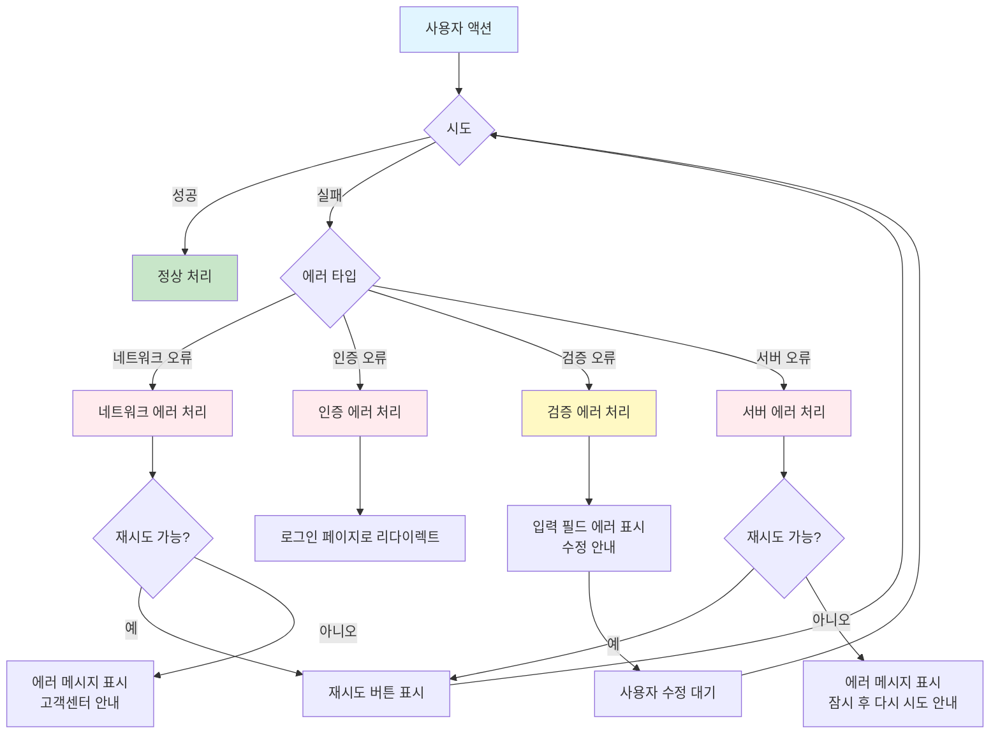

### 3.5.2 입력 검증 플로우

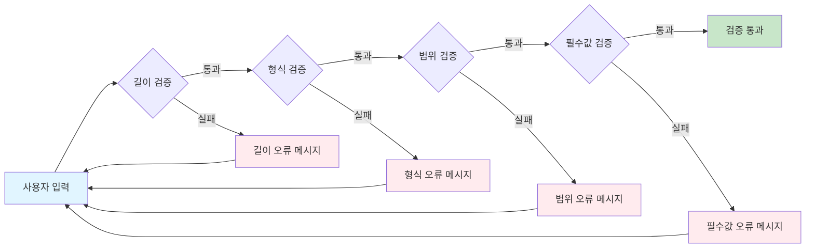

---

## 4. 화면 간 상호작용 다이어그램

### 4.1 전체 화면 네비게이션 맵

```mermaid
graph TB
    Home[홈페이지 /] --> Chat[채팅 /chat]
    Home --> SignIn[로그인 /sign-in]
    Home --> Dashboard[대시보드 /dashboard]

    SignIn --> Onboarding[역할 선택 /onboarding]
    SignIn --> Chat
    SignIn --> AdminDash[관리자 /admin/dashboard]

    Onboarding --> Chat
    Onboarding --> AdminDash

    Chat --> Recommend[추천 /recommendations/[id]]
    Chat --> Dashboard

    Recommend --> External[외부 구매 링크]
    Recommend --> IPPA[K-IPPA 평가 /dashboard/ippa/[id]]
    Recommend --> ConsultDetail[상담 상세 /consultation/[id]]

    Dashboard --> Chat
    Dashboard --> ConsultDetail
    Dashboard --> IPPA
    Dashboard --> Report[리포트 /consultation/report/[id]]

    ConsultDetail --> Recommend
    ConsultDetail --> Report

    AdminDash --> ConsultDetail
    AdminDash --> UserDetail[사용자 상세]

    style Home fill:#fff4e6
    style Chat fill:#f3e5f5
    style Recommend fill:#e8f5e9
    style Dashboard fill:#fff3e0
    style AdminDash fill:#ffebee
    style IPPA fill:#fce4ec
```

### 4.2 데이터 흐름 다이어그램

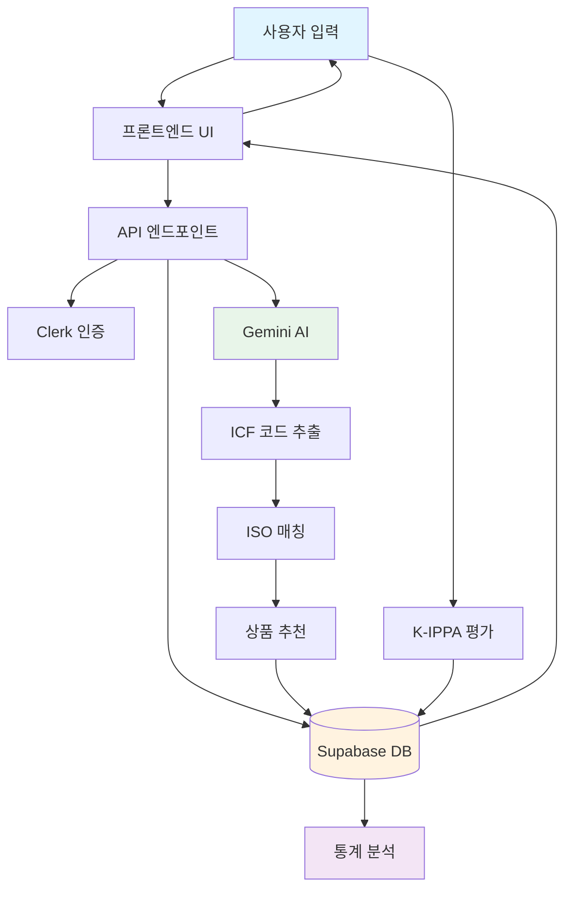

---

## 5. 공통 UI 컴포넌트

### 5.1 Header (공통 헤더)

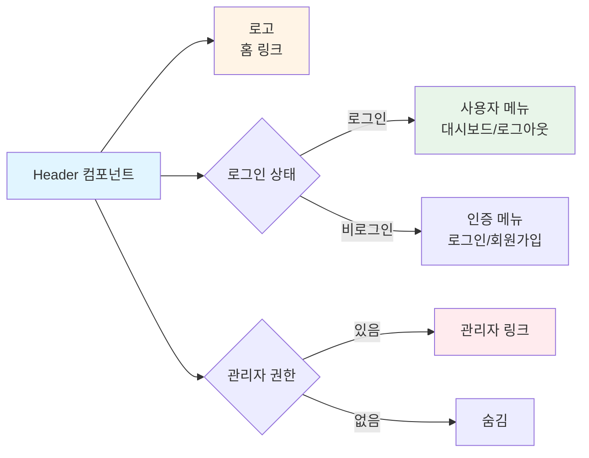

**구성 요소**:

- 로고 (홈으로 이동)
- 네비게이션 메뉴 (로그인 상태에 따라 변경)
- 사용자 메뉴 (로그인 시)
- 관리자 링크 (권한 있는 경우만 표시)

### 5.2 Footer (공통 푸터)

**구성 요소**:

- 이용약관 링크
- 개인정보처리방침 링크
- 문의 링크
- 저작권 정보

### 5.3 로딩 상태

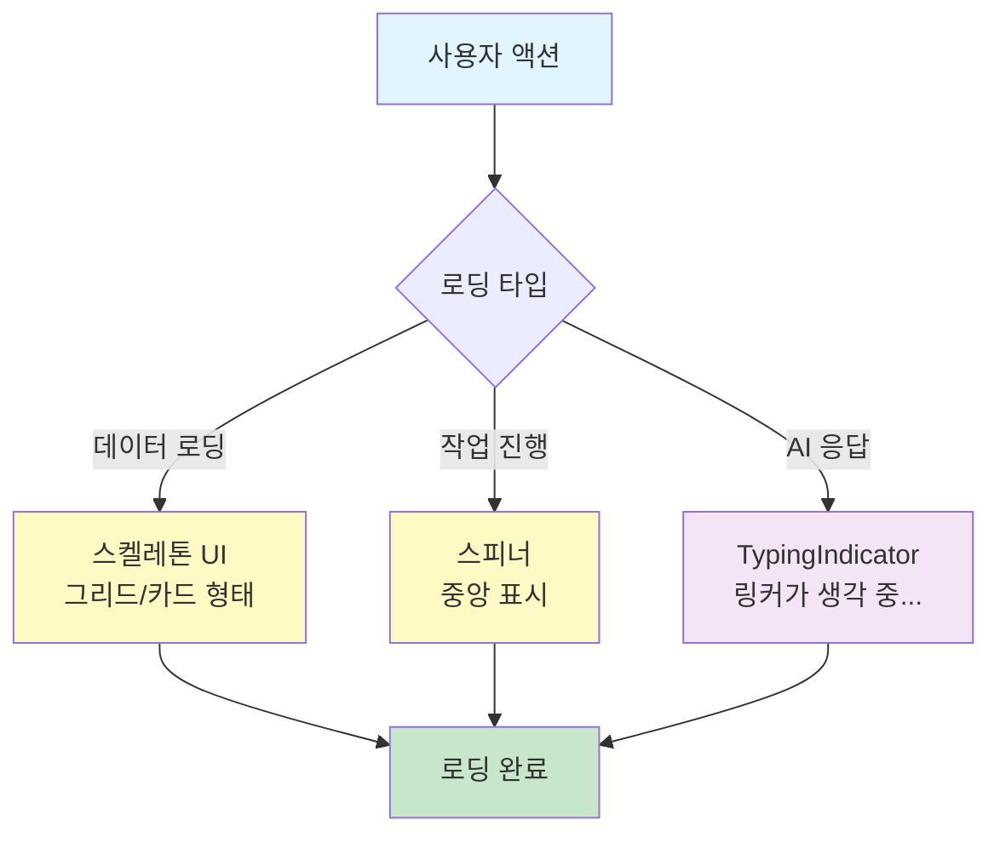

**구성 요소**:

- 스켈레톤 UI (데이터 로딩 중)
- 스피너 (작업 진행 중)
- TypingIndicator (AI 응답 생성 중)

### 5.4 에러 처리

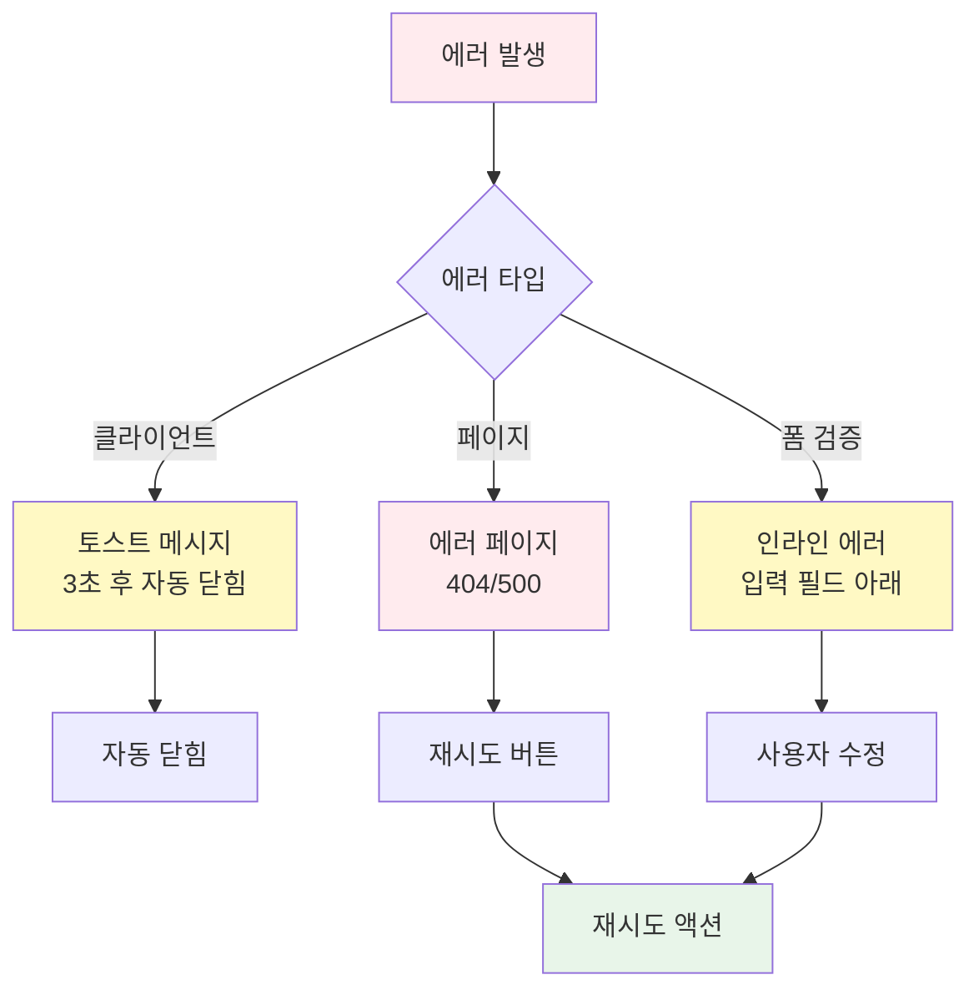

**구성 요소**:

- 에러 메시지 토스트
- 에러 페이지 (404, 500)
- 재시도 버튼

---

## 6. 접근성 (A11y) 고려사항

### 6.1 키보드 네비게이션

- 모든 인터랙션 요소는 Tab 키로 접근 가능
- Enter/Space로 버튼 활성화
- Esc로 모달 닫기

### 6.2 스크린 리더

- 모든 이미지에 alt 텍스트
- 버튼과 링크에 aria-label
- 폼 필드에 label 연결

### 6.3 색상 대비

- WCAG 2.1 AA 기준 준수
- 텍스트와 배경 최소 4.5:1 대비

### 6.4 포커스 표시

- 모든 포커스 가능 요소에 ring-2 ring-offset-2 ring-teal-600 적용

---

## 7. 반응형 디자인

### 7.1 모바일 (< 768px)

- 1열 레이아웃
- 햄버거 메뉴
- 터치 친화적 버튼 크기 (최소 44px)

### 7.2 태블릿 (768px - 1024px)

- 2열 레이아웃 (카드 그리드)
- 사이드바 접기/펼치기

### 7.3 데스크톱 (> 1024px)

- 3열 레이아웃 (카드 그리드)
- 전체 사이드바 표시

---

## 8. 성능 최적화

### 8.1 이미지 최적화

- Next.js Image 컴포넌트 사용
- WebP 형식 지원
- Lazy loading

### 8.2 코드 스플리팅

- 페이지별 동적 임포트
- 컴포넌트 레벨 코드 스플리팅

### 8.3 캐싱

- 정적 페이지 ISR (Incremental Static Regeneration)
- API 응답 캐싱

---

**문서 버전**: v1.2  
**최종 수정일**: 2025.01.XX  
**다음 검토 예정일**: 2025.02.XX
